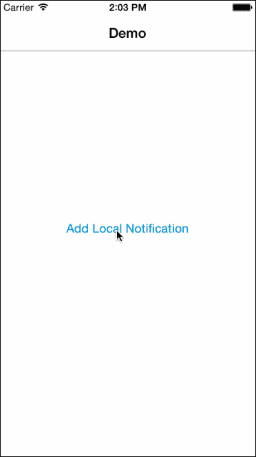

# EWTBackgroundLocalNotification

Show queued local notification as soon as app enters background.

# Preview


# Installation

## Cocoapods

EWTBackgroundLocalNotification is available through [CocoaPods](http://cocoapods.org). To install
it, simply add the following line to your Podfile:

```ruby
pod "EWTBackgroundLocalNotification"
```

# Usage

- Import the header
```objc
#import "EWTBackgroundLocalNotification.h"
```

- Create one or multiple local notification
```objc
//Sample local notification
UILocalNotification *notification = [[UILocalNotification alloc] init];
[notification setAlertBody:@"message"];
[notification setTimeZone:[NSTimeZone defaultTimeZone]];
[notification setUserInfo:@{@"info":message}];
```

- Add the notification to queue
```objc
[EWTBackgroundLocalNotification queueLocalNotification:notification];
```

- The local notification(s) queued would be shown when the app is brought to background.
